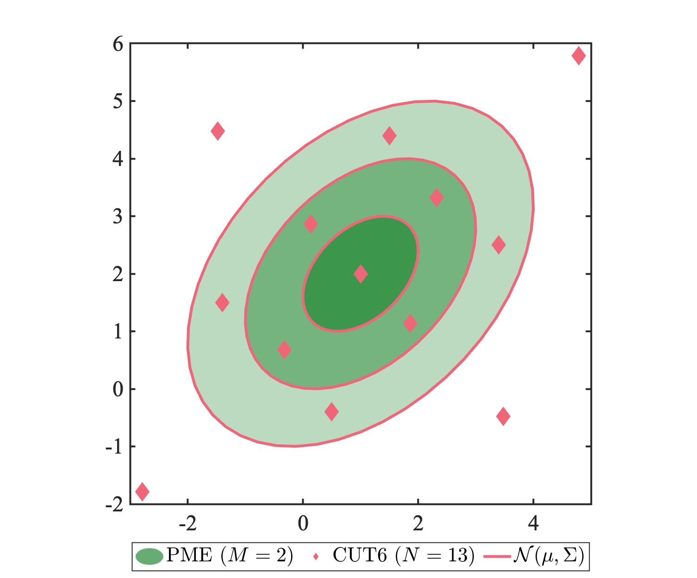
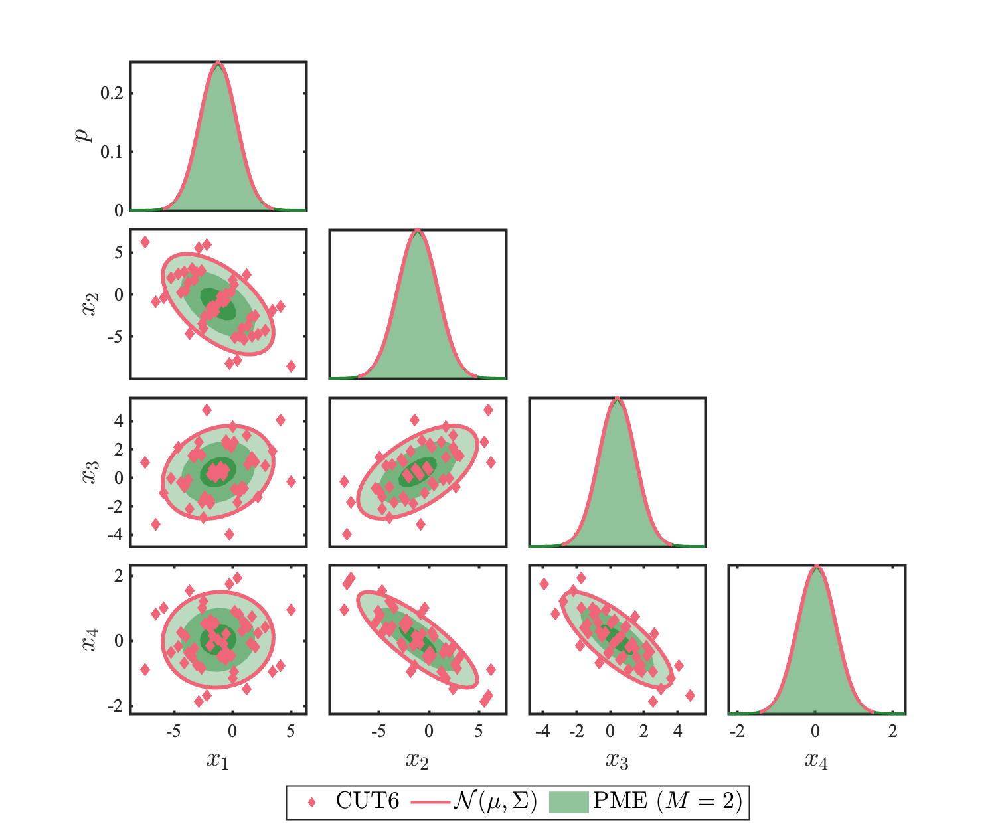
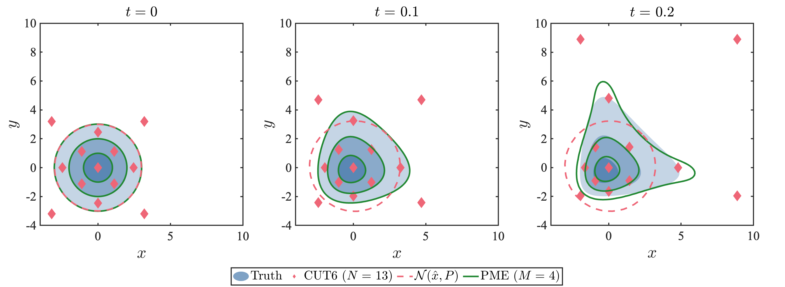

# Conjugate Unscented Transform to PDF using Principal of Maximum Entropy (PME)
These MATLAB functions takes the conjugate unscented transform (CUT) weighted sigma points and generates the probability distribution function (PDF) generated considering the principal of maximum entropy (PME), following Adurthi et al. [1].  

For a probability distribution function (PDF) $p(\bf{x})$, Shannon's entropy of the random variable $\bf{x}$ is given by

$$
\begin{equation}
    H(\bf{x}) = -\int_{\Omega} p(\bf{x})\log\{p(\bf{x})\}d\bf{x}
\end{equation}
$$

where the integration is over the support $\Omega$ of the PDF. Entropy is a real valued scalar quantity that can be assumed as a measure of uncertainty in the system. The uncertainty at any time can be described by the set of moments of the PDF, but two distinct PDFs can have the same finite set of moments. The principle of maximum entropy (PME) finds the PDF with the highest entropy, or the PDF representing the highest uncertainty with the same set of moments. The problem statement for the PME can be framed as

$$
\begin{equation}
    \begin{aligned}
        \max_{p(\bf{x})} &:-\int_{\Omega} p(\bf{x})\log\{p(\bf{x})\}d\bf{x} \\
        \text{subject to} &: \int_{\Omega} g_i(\bf{x}) p(\bf{x}) d\bf{x} = \mathbb{E}[g_i(\bf{x})] \triangleq M_i \quad \text{for} \quad i=1,2,\dots,p,
    \end{aligned}
\end{equation}
$$

where the set of functions $g_i(\bf{x})$ are the multidimensional monomials that represent moments of various orders.  

This function is meant to be used in tandem with [CUT.m](https://github.com/bhanson10/CUT).  

## Examples
I provide 3 examples on how to use the directory. Here are three figures created from test_pme_1.m, test_pme_2.m, and test_pme_3.m. 

  Please direct any questions to blhanson@ucsd.edu.   

## References
[1] N. Adurthi and P. Singla, “Conjugate unscented transformation-based approach for accurate conjunction analysis,” Journal of Guidance, Control, and Dynamics, vol. 38, no. 9, pp. 1642–1658, 2015.